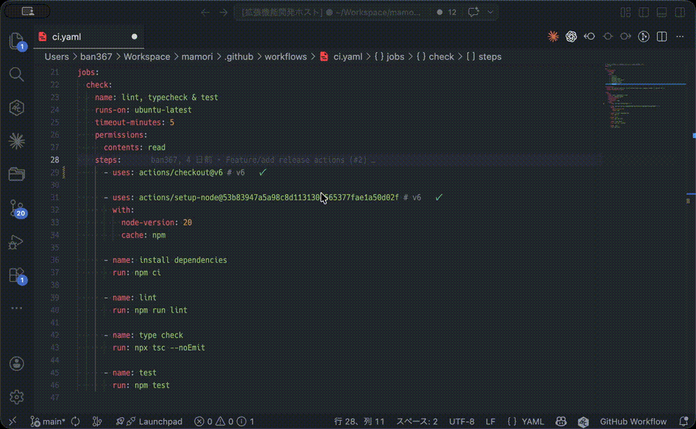
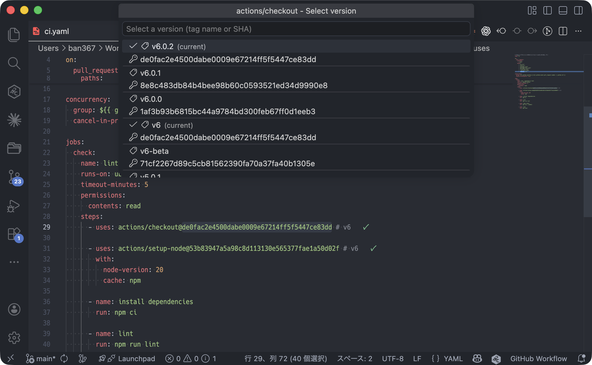

# Mamori - GitHub Actions Version Manager

[](https://marketplace.visualstudio.com/items?itemName=ban367.mamori)
[](LICENSE)

A VS Code extension that displays and manages action version information inline on `uses:` lines in GitHub Actions workflow files.



## Features

- **Inline version status** — Shows whether each action is up to date right next to the `uses:` line (✓ = latest, ⬆ = update available)
- **Double-click to change version** — Double-click the version portion to open a QuickPick and select a different version
- **Tag name / commit SHA selection** — Choose whether to replace with a tag name or commit SHA when selecting a version
- **SHA ⇔ Tag conversion** — Convert between SHA and tag with one click from the Command Palette
- **Hover for details** — View detailed information including current version, latest version, and SHA
- **CodeLens display** (optional) — Show version information above `uses:` lines
- **Offline support** — Displays version information using cached data even when offline



## Installation

### From VS Code Marketplace

[Mamori](https://marketplace.visualstudio.com/items?itemName=ban367.mamori)

1. Open the Extensions panel in VS Code (`Ctrl+Shift+X` / `Cmd+Shift+X`)
2. Search for `Mamori`
3. Click "Install"

### From VSIX

Download from [GitHub Releases](https://github.com/ban367/mamori/releases).

## Usage

1. Open a `.github/workflows/*.yml` or `action.yml` / `action.yaml` file
2. Version status will automatically appear next to `uses:` lines
3. Double-click the version portion to open the version switcher QuickPick
4. The following commands are also available from the Command Palette (`Ctrl+Shift+P` / `Cmd+Shift+P`):
   - **Mamori: Change Version** — Change the action version
   - **Mamori: Toggle SHA/Tag** — Convert between SHA and tag name
   - **Mamori: Refresh Version Info** — Re-fetch version information
   - **Mamori: Clear Cache** — Clear the version cache
   - **Mamori: Set GitHub Token** — Set a GitHub authentication token

## Configuration

| Setting                        | Type    | Default | Description                              |
| ------------------------------ | ------- | ------- | ---------------------------------------- |
| `mamori.cacheTtlMinutes`       | number  | `60`    | Cache TTL in minutes                     |
| `mamori.enableCodeLens`        | boolean | `false` | Enable CodeLens display                  |
| `mamori.enableDecorations`     | boolean | `true`  | Enable inline version decorations        |
| `mamori.maxConcurrentRequests` | number  | `5`     | Maximum number of concurrent API requests |

## GitHub Authentication

Setting up an authentication token is recommended to increase the GitHub API rate limit. Authentication is resolved in the following order:

1. **VS Code SecretStorage** — Set via `Mamori: Set GitHub Token` in the Command Palette
2. **GitHub CLI** — Output of `gh auth token`
3. **Environment variable** — `GITHUB_TOKEN`
4. **Unauthenticated** — Rate limited to 60 requests/hour

## Development

```sh
# Install dependencies
npm install

# Build
npm run build

# Watch mode
npm run watch

# Run tests
npm test

# Package extension
npm run package
```

## License

[MIT](LICENSE)

## Contributing

Contributions are welcome! Feel free to open an issue or submit a pull request for bug reports, feature requests, or improvements.

## Documentation

- [Design Doc](docs/design-doc.md) — Design documentation entry point
- [Changelog](CHANGELOG.md) — Release history
