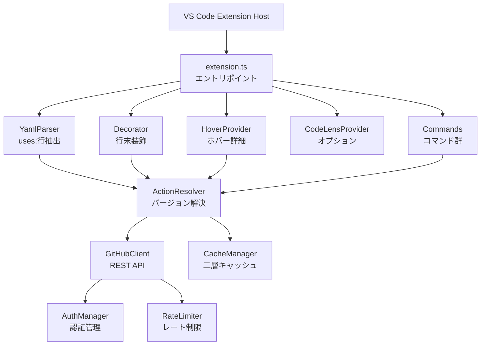
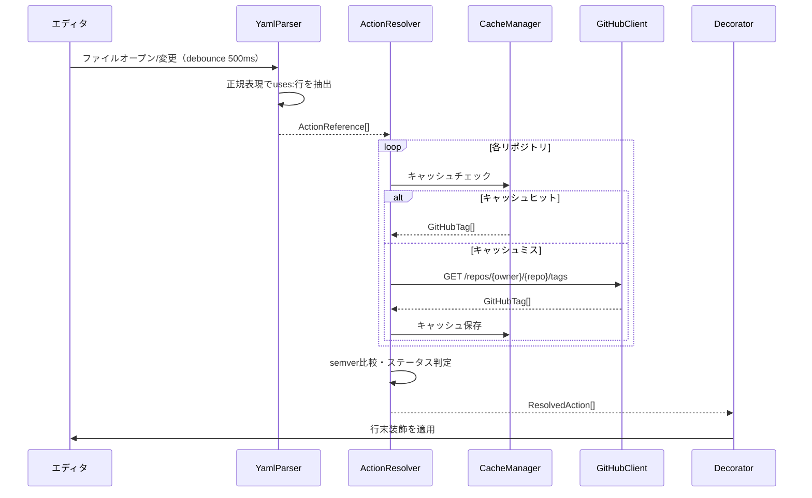

<!-- このファイルは docs/design-doc.md の一部です -->

# 設計概要: アーキテクチャ・データフロー

## 4. 設計概要

### アーキテクチャ図

### データフロー

### 主要コンポーネント

| コンポーネント     | 役割                                         | 技術                        |
| ------------------ | -------------------------------------------- | --------------------------- |
| YamlParser         | ドキュメントからuses:行を正規表現で抽出      | RegExp                      |
| ActionResolver     | バージョン解決のオーケストレーション          | TypeScript                  |
| GitHubClient       | GitHub REST APIによるタグ/リリース情報取得   | fetch API                   |
| CacheManager       | メモリ+永続の二層キャッシュ管理              | Map + globalState           |
| AuthManager        | GitHub認証トークンの優先順位付き管理          | SecretStorage + gh CLI      |
| Decorator          | TextEditorDecorationTypeによる行末装飾        | VS Code API                 |
| HoverProvider      | ホバー時の詳細表示とコマンドリンク            | VS Code API                 |
| CodeLensProvider   | 行上のバージョン変更リンク（オプション）      | VS Code API                 |
